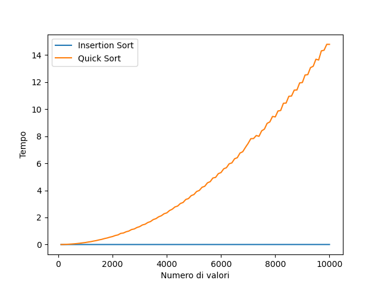
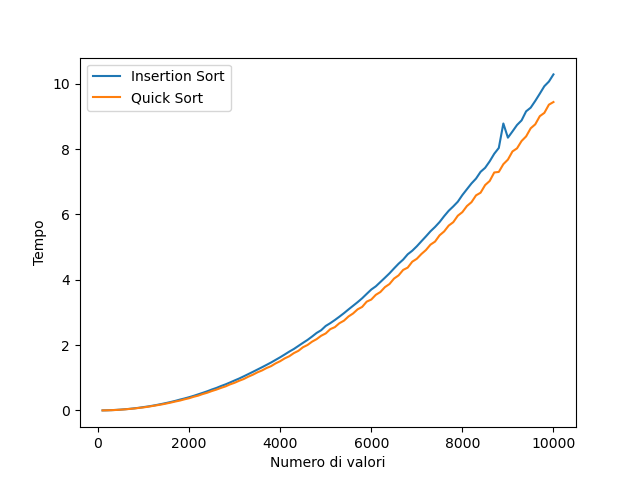
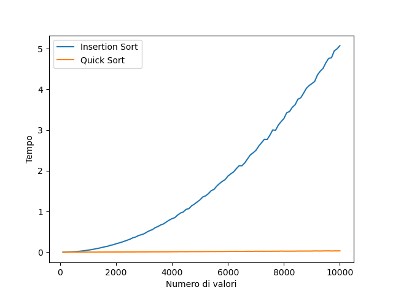

---
author:

- Leonardo Toccafondi   
  date: February, 2023
  title: Comparazione tra algoritmi di ordinamento Insertion Sort, Quick Sort

---

# Introduzione

Una delle classi di problemi più studiate nel campo dell’informatica sono i problemi di ordinamento. Essi possono essere
descritti nel seguente modo:

> *A partire da una sequenza di dati $S = \{x_1, \dotsc, x_n\}$ in ingresso trovare una permutazione $S^{\prime} = > >
> \{x_1^{\prime}, \dotsc , x_n^{\prime}\}$ di essa tale che $x_1^{\prime} \leq x_2^{\prime} \leq \dotsc \leq
x_n^\prime$.*

Per la loro risoluzione sono stati pensati numerosi algoritmi di ordinamento: ogni implementazione differisce
soprattutto per i campi di applicazione e per il comportamento rispetto a certe sequenze di ingresso. Per valutare quale
sia meglio usare è quindi necessario valutare la loro efficienza, ovvero quanto tempo impiegano ad essere eseguiti su
insiemi di dati particolari e con dimensione sempre crescente.
In questa relazione saranno analizzate le differenze, in senso di *complessità temporale*, di due algoritmi di
ordinamento: **Quick Sort** e **Insertion Sort**. In particolare saranno analizzati i loro andamenti
temporali all'aumentare del numero di elementi delle liste da ordinare.

# Teoria

### Insertion sort

#### Descrizione dell’algoritmo

Insertion sort è un algoritmo di ordinamento sul posto che prende prende in ingresso una sequenza di $n$ numeri
memorizzati in un array A, e restituisce una loro permutazione $\{A'_{1}, A'_{2}, \dotsc , A'_{n} \}$ ordinata.

Il funzionamento è simile a come si ordinano le carte in mano: alla j-esima iterazione l’algoritmo sposta" la chiave
indietro nell’array, finché non si trova n elemento minore oppure si è arrivati alla fine dell’array. In questo modo la
chiave viene inserita nella posizione corretta (j+1-esima posizione). Quindi ad ogni iterazione il sottoarray
$A[1, \dotsc, j-1]$ è formato da elementi che originariamente erano in $A[1, \dotsc, j-1]$, ma adesso sono **ordinati**.

Insertion sort è un algoritmo **stabile**, in quanto ordina gli elementi uguali nello stesso ordine in cui appaiono
nell'input. Inoltre ordina sul posto, senza l'ausilio di liste ulteriori. Inoltre è **adattivo**, in quanto è efficiente
per insiemi di dati che sono già sostanzialmente ordinati.

#### Prestazioni attese

Per definire le prestazioni attese di Insertion sort è necessario analizzare il suo costo. Per come è strutturato
l’algoritmo, la complessità dipende sia dalla dimensione dell’input, sia da come sono ordinati i dati. Quindi, a parità
di quantità di dati, l’algoritmo può essere più o meno veloce a seconda della loro disposizione nella sequenza. Per
questo motivo si distinguono tre casi:

- **Caso migliore:** gli elementi sono già ordinati. In questo caso il costo è $\Theta(n)$;

- **Caso peggiore:** gli elementi sono ordinati al contrario. In questo caso il costo è $\Theta(n^{2})$;

- **Caso medio:** gli elementi sono ordinati in modo casuale. Questo caso è simile al caso peggiore ed ha la stessa
  complessità

Rispetto ad un algoritmo *divide-et-impera* performa peggio per set di dati molto grandi, mentre ha ottime prestazioni
per set di dati più ridotti

### Quick Sort

#### Descrizione dell’algoritmo

Quick sort è un algoritmo di ordinamento sul posto ma, a differenza di insertion sort, è ricorsivo e si basa sul
principio *divide et impera*. Per ordinare un array $A[p,\_\_\_, r]$:

- **Divide:** partiziona l’array A in due sottoarray $A[p,\dotsc, q-1]$ e $A[q+1,\dotsc, r]$ tali che ogni elemento del
  primo sottoarray è minore di q (o uguale) e ogni elemento del secondo sottoarray è maggiore di q (o uguale).
  L’elemento $A[q]$ prende il nome di *pivot*.

- **Impera:** ordina i due sottoarray con chiamate ricorsive a se stessa.

- **Combina:** combina i due sottoarray ordinati per restituire l’array $A[p,\dotsc, r]$ ordinato.

#### Prestazioni attese

Il tempo di esecuzione del Quick sort dipende dal partizionamento dei sottoarray, ovvero se questi ultimi sono
bilanciati o sbilanciati:

- **Partizionamento nel caso peggiore:** si ha quando l’array è già ordinato. Infatti in questo caso la funzione
  partition divide il problema in due sottoproblemi, uno di grandezza $n - 1$ e l’altro di grandezza $0$. Il costo è,
  quindi, $\Theta(n^{2})$.

- **Partizionamento nel caso migliore:** si ha quando, ad ogni iterazione, il pivot scelto è l’elemento che divide
  l’array in due sottoproblemi di dimensione uguale. Quindi ciascun sottoarray avrà dimensione $\dfrac{n}{2}$. In questo
  caso il costo è $\mathcal{O}(n\log{}n)$

- **Partizionamento nel caso medio:** i due sottoarray sono divisi in modo casuale. Questo caso è simile al caso
  migliore ed ha la stessa complessità.

# Esperimenti svolti

In questa relazione, sono stati misurati i tempi di esecuzione degli algoritmi di ordinamento all'aumentare del numero
di elementi nella lista da passare agli stessi.
Gli esperimenti sono stati fatti su un numero massimo di nodi pari a 10000, andando a misurare sia i tempi di esecuzione
per array già ordinati (sia in senso crescente che decrescente), sia per un array randomizzato (viene passato lo stesso
in tutti e due i casi). Le misurazioni,
in questo caso, avvengono ogni incremento di 100 nodi.

I tempi di esecuzione sono stati salvati in delle liste separate, una per ciascun algoritmo, inserendo successivamente i
valori in una tabella, poi salvata in formato txt. Infine questi valori sono stati utilizzati per creare grafici
rappresentanti andamenti temporali.

Viene distinto il caso ordinato, da quello non ordinato, con un controllo sulla variabile booleana *shuffle*, grazie
alla quale il programma sa se randomizzare o meno i valori della lista da ordinare, se questa è pari a True. Altrimenti,
l'input non viene randomizzato e avrò come risultato il caso migliore di Insertion sort. Inoltre, con un altra variabile
booleana *rev* è possibile invertire l'ordine dell'array ordinato, ottenendo il caso peggiore di Insertion sort.

# Implementazione pratica

Il programma è suddiviso in più file:

- insertion_sort.py, quick_sort.py, i quali si occupano dell'implementazione degli algoritmi di ordinamento da testare;
- test.py: è il programma principale, si occupa del test degli algoritmi e della creazione dei grafici.

#### Ambiente di test

L'esperimento è stato svolto su un computer con le seguenti caratteristiche:

- Sistema operativo: Linux Mint 21.1 con kernel 5.15

- CPU: Inter Core i7-9750H

- RAM: 16 GB

- Interprete Python: conda 22.11.1 e python v 3.10

- IDE: Pycharm Community Edition 2022.3.2

# Risultati

### 10000 nodi

#### Conclusioni

Come si evince dai grafi, le performance attese da entrambi gli algoritmi di ordinamento sono state rispettate: infatti,
insertion sort risulta essere più efficace di Quick sort soltanto nel caso in cui l'array da ordinare sia già ordinato.
In questo caso quick sort è nel suo caso peggiore.

Osservando la figura 2, che rappresenta i tempi di esecuzione nel caso dell'array ordinato in senso decrescente (quindi
per il caso peggiore di insertion sort), si può vedere come quick sort si avvicini molto ai tempi di insertion sort, pur
rimanendo inferiore.

In figura 3, che raffigura i tempi di esecuzione per il caso medio di quick sort, è evidente la maggiore efficienza di
quick sort, che arriva ad essere centinaia di volte più veloce di insertion sort.

In conclusione quicksort è l'algoritmo preferibile nella quasi totalità delle applicazioni, nonostante questo insertion
sort ha comunque degli usi reali.\\
Un esempio può essere un insieme di dati dinamico, in cui vengono aggiunti spesso degli elementi che non modificano
troppo la struttura dell'insieme. In un caso come questo abbiamo un insieme quasi sempre ordinato a meno di qualche
elemento, caso in cui insertion sort ha un comportamento quasi lineare.
